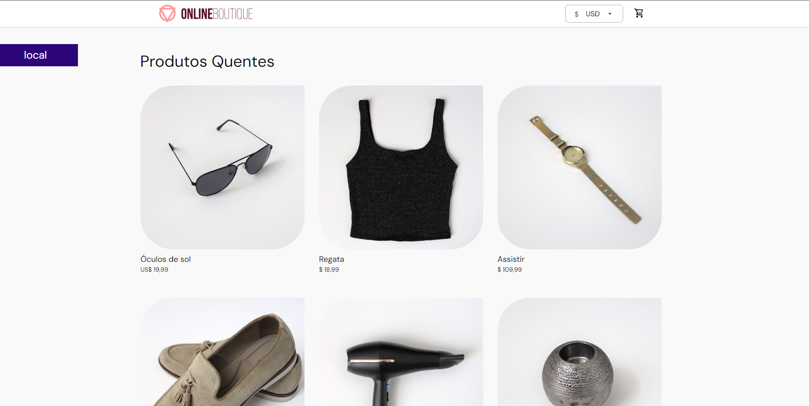
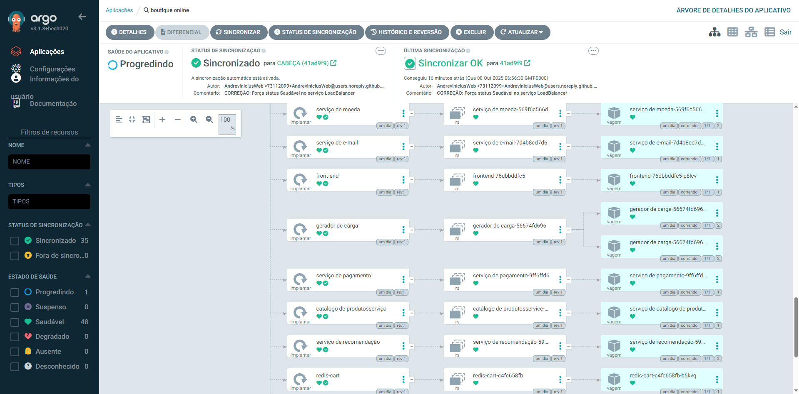

# Projeto: GitOps na Prática com Kubernetes e ArgoCD

Este repositório contém os manifestos Kubernetes para implantar a aplicação de microserviços "Online Boutique" utilizando uma abordagem GitOps com ArgoCD. O objetivo é demonstrar um fluxo de trabalho completo, desde a configuração do ambiente até a implantação e atualização automatizada.

## Objetivo do Projeto

> Executar um conjunto de microserviços (Online Boutique) em Kubernetes local usando Rancher Desktop, controlado por GitOps com ArgoCD, a partir de um repositório público no GitHub.

## Resultado Final



## Tecnologias Utilizadas

-   **Kubernetes** (orquestrador de contêineres, provido pelo Rancher Desktop)
-   **ArgoCD** (ferramenta de automação de deploy contínuo baseada em GitOps)
-   **Rancher Desktop** (para criação de um cluster Kubernetes local)
-   **Git & GitHub** (como fonte única da verdade para a configuração da infraestrutura)
-   **Docker** (Container Engine)
-   **kubectl** (ferramenta de linha de comando para interagir com o cluster)

## Pré-requisitos

Antes de começar, garanta que você tenha as seguintes ferramentas instaladas e configuradas:

-   [Rancher Desktop](https://rancherdesktop.io/) instalado, com o Kubernetes habilitado.
-   [Git](https://git-scm.com/downloads) instalado.
-   Uma conta no [GitHub](https://github.com/).
-   `kubectl` configurado e funcionando (verifique com `kubectl get nodes`).
-   Docker funcionando localmente (gerenciado pelo Rancher Desktop).

---

## Guia de Instalação Passo a Passo

Siga os passos abaixo para replicar o projeto.

### Passo 1: Preparar o Repositório GitHub

O GitOps utiliza um repositório Git como fonte da verdade. Este repositório conterá apenas os manifestos YAML que descrevem o estado desejado da nossa aplicação.

1.  **Faça um Fork do repositório da aplicação:**
    -   O primeiro passo, conforme o documento do projeto, é criar uma cópia pessoal (um "fork") do repositório original que contém a aplicação.
    -   Acesse o link a seguir e clique em **"Fork"**: `https://github.com/GoogleCloudPlatform/microservices-demo`.
    -   Isso criará uma cópia completa do projeto na sua conta do GitHub, permitindo que você tenha acesso aos arquivos de manifesto.

2.  **Crie um novo repositório público para o GitOps:**
    -   Agora, crie um segundo repositório, que deve ser **novo e vazio**. É neste repositório que a prática de GitOps será aplicada. Usamos o nome `gitops-microservices`.

3.  **Clone seu repositório GitOps e adicione o manifesto:**
    -   No repositório que você **fez o fork** (`microservices-demo`), localize e copie todo o conteúdo do arquivo `release/kubernetes-manifests.yaml`.
    -   No seu repositório local `gitops-microservices`, crie a seguinte estrutura de arquivos:
        ```
        /
        └── k8s/
            └── online-boutique.yaml
        ```
    -   Cole o conteúdo copiado no arquivo `online-boutique.yaml`.

4.  **Envie as alterações para o GitHub:**
    ```bash
    git add .
    git commit -m "Adiciona manifesto da aplicação Online Boutique"
    git push origin main
    ```

### Passo 2: Instalar o ArgoCD no Cluster

Com o repositório pronto, vamos instalar o ArgoCD no nosso cluster Kubernetes local.

1.  **Crie o namespace para o ArgoCD:**
    ```bash
    kubectl create namespace argocd
    ```

2.  **Aplique o manifesto de instalação do ArgoCD:**
    ```bash
    kubectl apply -n argocd -f [https://raw.githubusercontent.com/argoproj/argo-cd/stable/manifests/install.yaml](https://raw.githubusercontent.com/argoproj/argo-cd/stable/manifests/install.yaml)
    ```

### Passo 3: Acessar a Interface do ArgoCD

1.  **Abra um túnel de comunicação (port-forward) para o servidor do ArgoCD.** Mantenha este terminal aberto.
    ```bash
    kubectl port-forward svc/argocd-server -n argocd 8080:443
    ```

2.  **Obtenha a senha inicial.** Abra um **novo terminal** e execute o comando abaixo.
    -   *Para Linux/macOS:*
        ```bash
        kubectl -n argocd get secret argocd-initial-admin-secret -o jsonpath="{.data.password}" | base64 -d
        ```
    -   *Para Windows (PowerShell):*
        ```powershell
        [System.Text.Encoding]::UTF8.GetString([System.Convert]::FromBase64String((kubectl -n argocd get secret argocd-initial-admin-secret -o jsonpath='{.data.password}')))
        ```

3.  **Faça login** em `https://localhost:8080` com o usuário `admin` e a senha obtida.





### Passo 4: Criar e Sincronizar a Aplicação

1.  Na interface do ArgoCD, clique em **"+ NEW APP"**.
2.  Preencha as informações:
    -   **Application Name**: `online-boutique`
    -   **Project Name**: `default`
    -   **Sync Policy**: `Automatic` (para atualizações automáticas)
    -   **Repository URL**: URL do seu repositório `gitops-microservices`.
    -   **Revision**: `HEAD`
    -   **Path**: `k8s`
    -   **Cluster URL**: `https://kubernetes.default.svc`
    -   **Namespace**: `default`
3.  Clique em **"CREATE"**. Como a política de sincronização é automática, o ArgoCD irá começar a implantar a aplicação imediatamente.

### Passo 5: Acessar a Aplicação Online Boutique

O frontend não é exposto externamente por padrão. Use `port-forward` para acessá-lo.

1.  Execute em um novo terminal:
    ```bash
    kubectl port-forward svc/frontend-external 8081:80
    ```

2.  Acesse a loja em `http://localhost:8081` no seu navegador.

---

## Solução de Problemas Comuns

### Problema: Status "Progressing" no ArgoCD não desaparece

-   **Causa:** O serviço `frontend-external` é do tipo `LoadBalancer`. Em um ambiente local como o Rancher Desktop, ele nunca recebe um IP externo real, que é o que o Health Check do ArgoCD espera.
-   **Solução:** Adicione uma anotação no manifesto YAML para forçar o status "Healthy".

1.  **Edite o arquivo `k8s/online-boutique.yaml`:**
2.  Encontre o serviço `frontend-external` e adicione a anotação `argocd.argoproj.io/health: "healthy"`:

    ```yaml
    apiVersion: v1
    kind: Service
    metadata:
      name: frontend-external
      annotations:
        argocd.argoproj.io/health: "healthy"
    spec:
      type: LoadBalancer
      ...
    ```
3.  **Envie a alteração para o GitHub.** O ArgoCD irá sincronizar automaticamente e o status da aplicação deverá mudar para `Healthy`.

---
## Testando o Ciclo de Automação (GitOps)

Para validar a automação, podemos alterar o número de réplicas de um serviço.

1.  No arquivo `k8s/online-boutique.yaml`, encontre o `Deployment` do `recommendationservice`.
2.  Altere a linha `replicas: 1` para `replicas: 2`.
3.  Salve e envie a alteração para o GitHub:
    ```bash
    git add .
    git commit -m "Escala recommendationservice para 2 réplicas"
    git push
    ```
4.  Observe a interface do ArgoCD. Ele irá detectar a mudança e, automaticamente, criará um novo pod para o serviço. Verifique com `kubectl get pods` para confirmar que há duas instâncias do `recommendationservice` em execução.

5.  Ao final deste ciclo, você terá validado na prática o poder do GitOps: a alteração de uma única linha de código em seu repositório Git resultou em uma mudança controlada, auditável e automatizada em um ambiente Kubernetes em execução. O ArgoCD atuou como o agente que garante que o estado real do cluster sempre convirja para o estado desejado, que está versionado no Git.
